**Identifying Runs for bias correction**
================
Ruth C E Bowyer
2023-05-19

``` r
rm(list=ls())

library(tidyverse)
library(ggplot2)
library(RColorBrewer)
```

## **0. About**

Script to identify the mean, 2nd highest and 2nd lowers daily tasmax per
UKCP18 CPM run.

These runs will be the focus of initial bias correction focus

## **1. Load Data**

Data is tasmax runs converted to dataframe using sript
‘ConvertingAllCPMdataTOdf.R’, with files later renamed.Then daily means
for historical periods and future periods were calculated using
‘calc.mean.sd.daily.R’ and summaries saved as .csv

In retrospect the conversion to df might not have been necessary/the
most resource efficient, see comment
here:<https://tmieno2.github.io/R-as-GIS-for-Economists/turning-a-raster-object-into-a-data-frame.html>

``` r
Runs <- c("01", "04", "05", "06", "07", "08", "09", "10", "11", "12", "13", "15")

files <- list.files("/Users/rbowyer/Library/CloudStorage/OneDrive-TheAlanTuringInstitute/tempdata/")

files <- files[grepl(".csv", files)]
fp <- paste0("/Users/rbowyer/Library/CloudStorage/OneDrive-TheAlanTuringInstitute/tempdata/", files)
```

``` r
names <- gsub("df.avs_|.csv|df.", "", files)
names_hist <- names[grepl("hist", names)]
names_y21_40 <- names[grepl("Y21_Y40", names)]
names_y61_80 <- names[grepl("Y61_Y80", names)]

fp_hist <- fp[grepl("_hist", fp)]
fp_y21_40 <- fp[grepl("Y21_Y40", fp)]
fp_y61_80 <- fp[grepl("Y61_Y80", fp)]

dfs_hist <- lapply(fp_hist, read.csv)
names(dfs_hist) <- names_hist

dfs_y21_40 <- lapply(fp_y21_40, read.csv)
names(dfs_y21_40) <- names_y21_40


dfs_y61_80 <- lapply(fp_y61_80, read.csv)
names(dfs_y61_80) <- names_y61_80
```

## **2. Comparing Runs**

### **2a. Historical figures**

``` r
Y <- rep(c(1981:2000), each=360)  

dfs_hist <- lapply(names_hist, function(i){
  df <- dfs_hist[[i]]
  names(df) <- c("day", "mean", "sd")
  df$model <- i
  df$dn <- 1:nrow(df)
  df$Y <- Y
  return(df)
})

#Create a single df in long form of Runs for the historical period 
historical_means <- dfs_hist %>% reduce(rbind)
```

### **Time series - daily **

``` r
ggplot(historical_means) + 
    geom_line(aes(x=dn, y=mean, group=model, colour=model)) +

    theme_bw() + xlab("Day (Historical 1980 - 2000)") + 
    ylab("Daily mean max temp (tasmax) oC") + 

   scale_colour_brewer(palette = "Paired", name = "") +
    theme(axis.text.x=element_blank(),
        axis.ticks.x=element_blank(),
        legend.position = "none") + 
  facet_wrap(.~ model, ncol=3) 
```

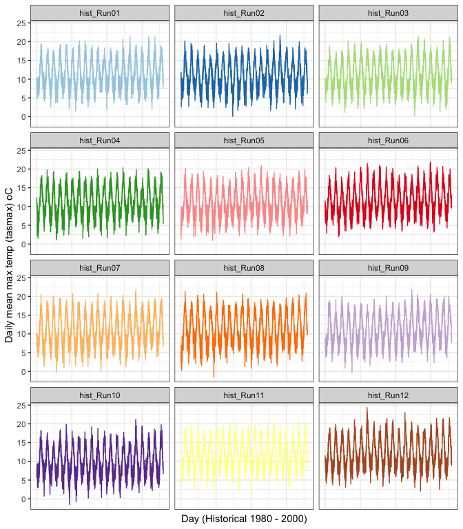<!-- -->

### **boxplot - mean historical**

``` r
#Create a pallete specific to the runs so when reordered maintain the same colours 
historical_means$model <- as.factor(historical_means$model)
c <- brewer.pal(12, "Paired")
my_colours <- setNames(c, levels(historical_means$model))
```

``` r
historical_means %>% 
  mutate(model = fct_reorder(model, mean, .fun='median')) %>%
    ggplot(aes(x=reorder(model, mean), y=mean, fill=model)) + 
    geom_boxplot() + theme_bw() + 
    ylab("Mean daily max temp (tasmax) oC") + xlab("model") +
    scale_fill_manual(values = my_colours) +
    theme(axis.text.x=element_blank(),
        axis.ticks.x=element_blank())
```

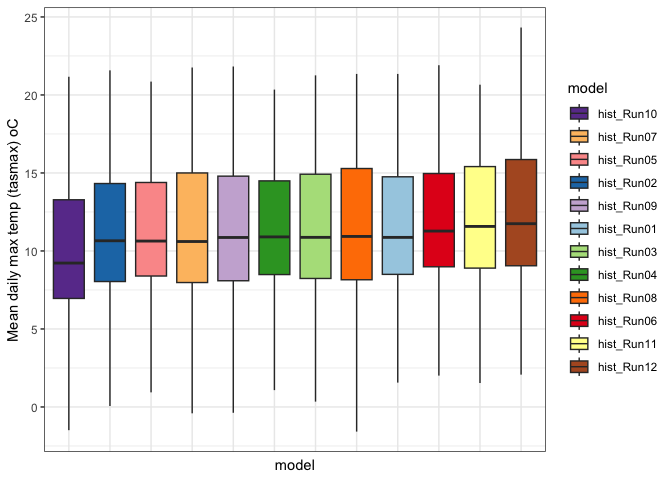<!-- -->

### **qqplot - daily means**

``` r
ggplot(historical_means, aes(sample=mean, colour=factor(model))) +
  stat_qq() +
  stat_qq_line()+
  theme_bw()+
  scale_color_manual(values = my_colours) +
  facet_wrap(.~model, ncol=3)
```

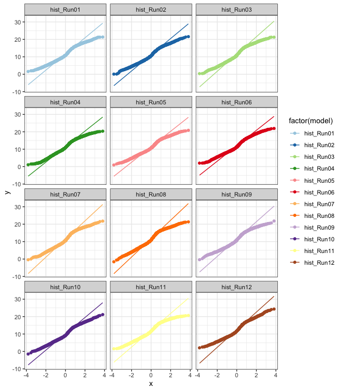<!-- -->

### **Time series - annual mean **

``` r
#Aggregating to year for annual average 

historical_means$Yf <- as.factor(historical_means$Y)

historical_means_y <- historical_means %>% 
  group_by(Yf, model) %>%
  dplyr::summarise(mean.annual=mean(mean, na.rm=T), sd.annual=sd(mean, na.rm = T))
```

``` r
ggplot(historical_means_y) + 
    geom_line(aes(x = as.numeric(Yf), y=mean.annual, 
              color=model)) +
    theme_bw() + xlab("Year (Historical 1980 - 2000)") + 
    ylab("Annual mean of mean daily max temp (tasmax) oC") + 
  scale_fill_brewer(palette = "Paired", name = "") +
   scale_colour_brewer(palette = "Paired", name = "") +
    theme(axis.text.x=element_blank(),
        axis.ticks.x=element_blank()) 
```

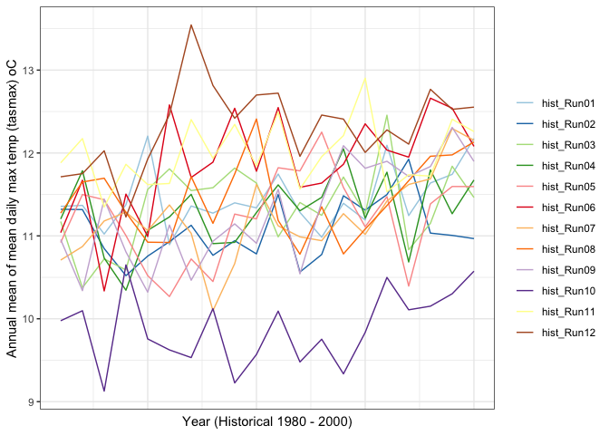<!-- -->

``` r
# Plotting with SDs in geom_ribbon to see if anything wildely different
ggplot(historical_means_y) + 
    geom_ribbon(aes(as.numeric(Yf), y=mean.annual, 
                               ymin = mean.annual - sd.annual,
                              ymax= mean.annual + sd.annual,
                    fill=model),  alpha=0.4) + 
    geom_line(aes(x = as.numeric(Yf), y=mean.annual, 
              color=model)) +
    theme_bw() + xlab("Year (Historical 1980 - 2000)") + 
    ylab("Annual mean of mean daily max temp (tasmax) oC") + 
  scale_fill_brewer(palette = "Paired", name = "") +
   scale_colour_brewer(palette = "Paired", name = "") +
    theme(axis.text.x=element_blank(),
        axis.ticks.x=element_blank()) + facet_wrap(.~model, ncol=3)
```

<!-- -->

### **boxplot - annual mean historical**

``` r
historical_means_y %>% 
  mutate(model = fct_reorder(model, mean.annual, .fun='median')) %>%
    ggplot(aes(x=reorder(model, mean.annual), y=mean.annual, fill=model)) + 
    geom_boxplot() + theme_bw() + 
    ylab("Annual max daily max temp oC") + xlab("model") +
   scale_fill_manual(values = my_colours) +
    theme(axis.text.x=element_blank(),
        axis.ticks.x=element_blank())
```

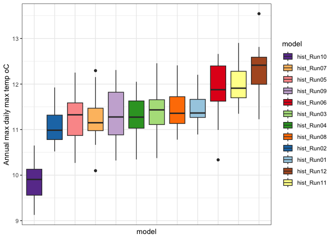<!-- -->

### **qqplot - annual means**

``` r
ggplot(historical_means_y, aes(sample=mean.annual, colour=factor(model))) +
  stat_qq() +
  stat_qq_line()+
  theme_bw()+
  scale_color_manual(values = my_colours) +
  facet_wrap(.~model, ncol=3)
```

<!-- -->

### **Time series - annual max **

``` r
historical_max_y <- historical_means %>% 
  group_by(Yf, model) %>%
  dplyr::summarise(max=max(mean, na.rm=T))
```

``` r
ggplot(historical_max_y) +
      geom_line(aes(x = as.numeric(Yf), y=max, 
              color=model)) +
    theme_bw() + xlab("Year (Historical 1980 - 2000)") + 
    ylab("Annual max of mean daily max temp (tasmax) oC") + 
  scale_fill_brewer(palette = "Paired", name = "") +
   scale_colour_brewer(palette = "Paired", name = "") +
    theme(axis.text.x=element_blank(),
        axis.ticks.x=element_blank()) 
```

<!-- -->

### **boxplot - annual max**

``` r
historical_max_y %>% 
  mutate(model = fct_reorder(model, max, .fun='median')) %>%
    ggplot(aes(x=reorder(model, max), y=max, fill=model)) + 
    geom_boxplot() + theme_bw() + 
    ylab("Annual max of mean daily max temp (tasmax) oC") + xlab("model") +
   scale_fill_manual(values = my_colours) +
    theme(axis.text.x=element_blank(),
        axis.ticks.x=element_blank())
```

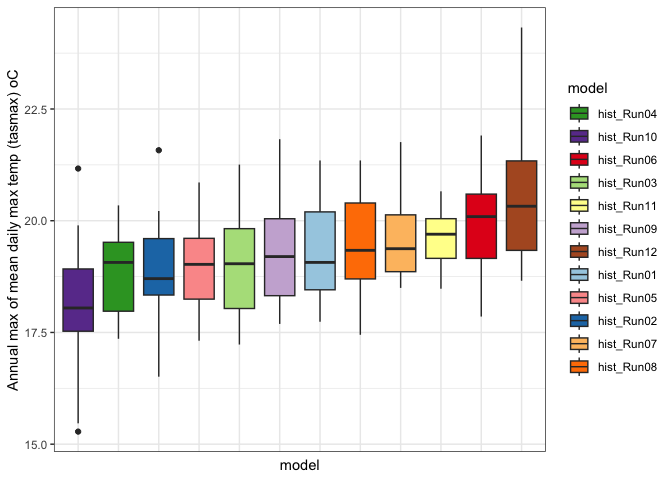<!-- -->

The daily max is quite different than the means - something to bear in
mind but interesting to think about - eg Run 4 here has the 2nd lowest
spread of max max temp, but is selected above based on means

### **ANOVA**

Daily means:

``` r
#-1 removes the intercept to compare coefficients of all Runs
av1 <- aov(mean ~ model - 1, historical_means)
av1$coefficients[order(av1$coefficients)]
```

    ## modelhist_Run10 modelhist_Run02 modelhist_Run05 modelhist_Run07 modelhist_Run09 
    ##         9.89052        11.06863        11.21424        11.22048        11.27647 
    ## modelhist_Run04 modelhist_Run03 modelhist_Run08 modelhist_Run01 modelhist_Run06 
    ##        11.29057        11.35848        11.45257        11.45414        11.86451 
    ## modelhist_Run11 modelhist_Run12 
    ##        11.99148        12.31870

Annual means:

``` r
av2 <- aov(mean.annual ~ model - 1, historical_means_y)
av2$coefficients[order(av2$coefficients)]
```

    ## modelhist_Run10 modelhist_Run02 modelhist_Run05 modelhist_Run07 modelhist_Run09 
    ##         9.89052        11.06863        11.21424        11.22048        11.27647 
    ## modelhist_Run04 modelhist_Run03 modelhist_Run08 modelhist_Run01 modelhist_Run06 
    ##        11.29057        11.35848        11.45257        11.45414        11.86451 
    ## modelhist_Run11 modelhist_Run12 
    ##        11.99148        12.31870

Max of means:

``` r
av3 <- aov(max ~ model - 1, historical_max_y)
av3$coefficients[order(av3$coefficients)]
```

    ## modelhist_Run10 modelhist_Run04 modelhist_Run02 modelhist_Run05 modelhist_Run03 
    ##        18.12329        18.81126        18.90054        19.01801        19.10454 
    ## modelhist_Run09 modelhist_Run01 modelhist_Run08 modelhist_Run07 modelhist_Run11 
    ##        19.23705        19.31541        19.44439        19.54981        19.57548 
    ## modelhist_Run06 modelhist_Run12 
    ##        19.88375        20.47650

Max vals are different but based on means then selection would be Run 02
(2nd lowest), Run 04 & Run 03, and Run 11 (2nd lowest)

### **2b. Y2020 - Y2040**

``` r
Y <- rep(c(2021:2040), each=360)  


dfs_y21_40 <- lapply(names_y21_40, function(i){
  df <- dfs_y21_40[[i]]
  names(df) <- c("day", "mean", "sd")
  df$model <- i
  df$dn <- 1:nrow(df)
  df$Y <- Y
  return(df)
})

#Create a single df in long form of Runs for the y21_40 period 
y21_40_means <- dfs_y21_40 %>% reduce(rbind)
```

### **Time series - daily **

``` r
ggplot(y21_40_means) + 
    geom_line(aes(x=dn, y=mean, group=model, colour=model)) +
  # Removing sd ribbon for ease of viewing
  #geom_ribbon(aes(x =dn, ymin = mean - sd, ymax= mean + sd), alpha=0.4) + 
    theme_bw() + xlab("Day (y21_40 1980 - 2000)") + 
    ylab("Daily mean max temp (tasmax) oC") + 
  #scale_fill_brewer(palette = "Paired", name = "") +
   scale_colour_brewer(palette = "Paired", name = "") +
    theme(axis.text.x=element_blank(),
        axis.ticks.x=element_blank(),
        legend.position = "none") + 
  facet_wrap(.~ model, ncol=3) + guides(fill = FALSE)  
```

    ## Warning: The `<scale>` argument of `guides()` cannot be `FALSE`. Use "none" instead as
    ## of ggplot2 3.3.4.
    ## This warning is displayed once every 8 hours.
    ## Call `lifecycle::last_lifecycle_warnings()` to see where this warning was
    ## generated.

<!-- -->

### **boxplot - mean y21_40**

``` r
#Create a pallete specific to the runs so when reordered maintain the same colours 
y21_40_means$model <- as.factor(y21_40_means$model)
c <- brewer.pal(12, "Paired")
my_colours <- setNames(c, levels(y21_40_means$model))
```

``` r
y21_40_means %>% 
  mutate(model = fct_reorder(model, mean, .fun='median')) %>%
    ggplot(aes(x=reorder(model, mean), y=mean, fill=model)) + 
    geom_boxplot() + theme_bw() + 
    ylab("Mean daily max temp (tasmax) oC") + xlab("model") +
    scale_fill_manual(values = my_colours) +
    theme(axis.text.x=element_blank(),
        axis.ticks.x=element_blank())
```

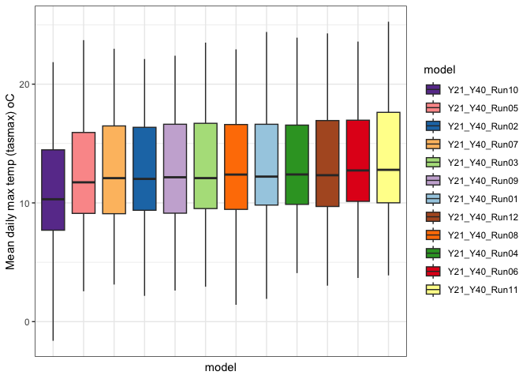<!-- -->

### **qqplot - daily means**

``` r
ggplot(y21_40_means, aes(sample=mean, colour=factor(model))) +
  stat_qq() +
  stat_qq_line()+
  theme_bw()+
  scale_color_manual(values = my_colours) +
  facet_wrap(.~model, ncol=3)
```

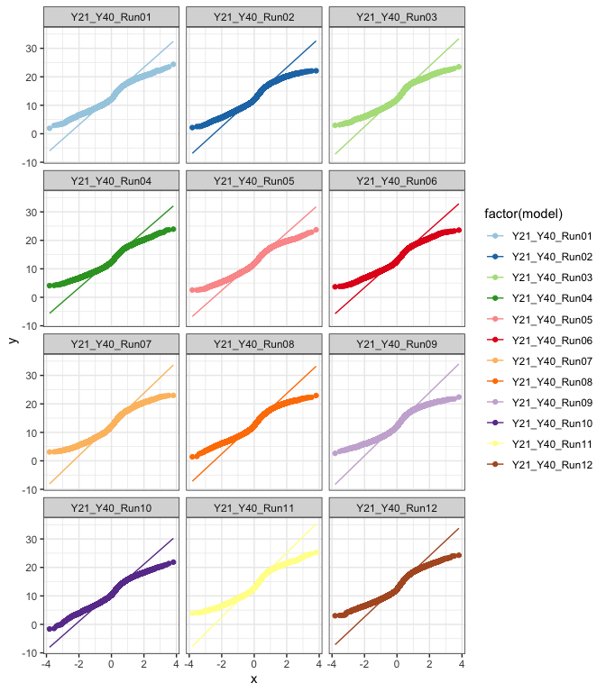<!-- -->

### **Time series - annual mean **

``` r
#Aggregating to year for annual average 

y21_40_means$Yf <- as.factor(y21_40_means$Y)

y21_40_means_y <- y21_40_means %>% 
  group_by(Yf, model) %>%
  dplyr::summarise(mean.annual=mean(mean, na.rm=T), sd.annual=sd(mean, na.rm = T))
```

``` r
ggplot(y21_40_means_y) + 
    geom_line(aes(x = as.numeric(Yf), y=mean.annual, 
              color=model)) +
    theme_bw() + xlab("Year (2021 - 2040)") + 
    ylab("Annual mean of mean daily max temp (tasmax) oC") + 
  scale_fill_brewer(palette = "Paired", name = "") +
   scale_colour_brewer(palette = "Paired", name = "") +
    theme(axis.text.x=element_blank(),
        axis.ticks.x=element_blank()) 
```

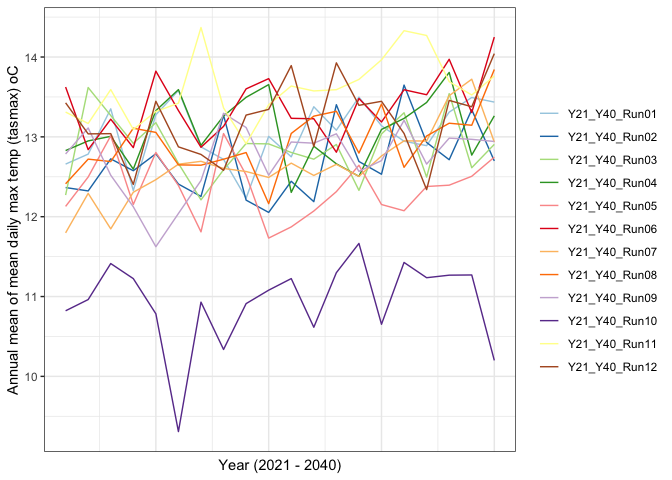<!-- -->

``` r
# Plotting with SDs in geom_ribbon to see if anything wildely different
ggplot(y21_40_means_y) + 
    geom_ribbon(aes(as.numeric(Yf), y=mean.annual, 
                               ymin = mean.annual - sd.annual,
                              ymax= mean.annual + sd.annual,
                    fill=model),  alpha=0.4) + 
    geom_line(aes(x = as.numeric(Yf), y=mean.annual, 
              color=model)) +
    theme_bw() + xlab("Year (2021 - 2040)") + 
    ylab("Annual mean of mean daily max temp (tasmax) oC") + 
  scale_fill_brewer(palette = "Paired", name = "") +
   scale_colour_brewer(palette = "Paired", name = "") +
    theme(axis.text.x=element_blank(),
        axis.ticks.x=element_blank()) + facet_wrap(.~model, ncol=3)
```

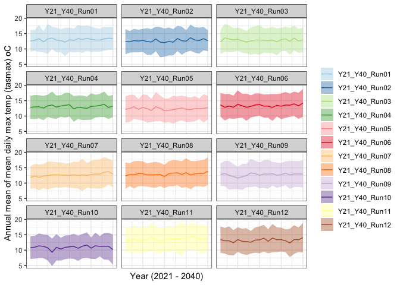<!-- -->

### **boxplot - annual mean y21_40**

``` r
y21_40_means_y %>% 
  mutate(model = fct_reorder(model, mean.annual, .fun='median')) %>%
    ggplot(aes(x=reorder(model, mean.annual), y=mean.annual, fill=model)) + 
    geom_boxplot() + theme_bw() + 
    ylab("Annual max daily max temp oC") + xlab("model") +
   scale_fill_manual(values = my_colours) +
    theme(axis.text.x=element_blank(),
        axis.ticks.x=element_blank())
```

<!-- -->

### **qqplot - annual means**

``` r
ggplot(y21_40_means_y, aes(sample=mean.annual, colour=factor(model))) +
  stat_qq() +
  stat_qq_line()+
  theme_bw()+
  scale_color_manual(values = my_colours) +
  facet_wrap(.~model, ncol=3)
```

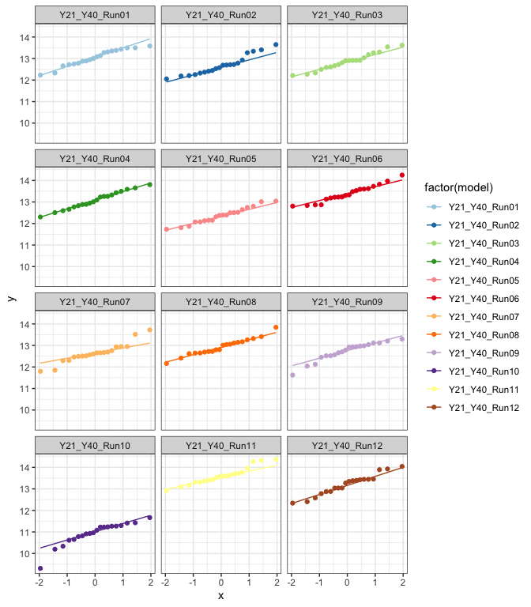<!-- -->

### **Time series - annual max **

``` r
y21_40_max_y <- y21_40_means %>% 
  group_by(Yf, model) %>%
  dplyr::summarise(max=max(mean, na.rm=T))
```

``` r
ggplot(y21_40_max_y) +
      geom_line(aes(x = as.numeric(Yf), y=max, 
              color=model)) +
    theme_bw() + xlab("Year (2021 - 2040)") + 
    ylab("Annual max of mean daily max temp (tasmax) oC") + 
  scale_fill_brewer(palette = "Paired", name = "") +
   scale_colour_brewer(palette = "Paired", name = "") +
    theme(axis.text.x=element_blank(),
        axis.ticks.x=element_blank()) 
```

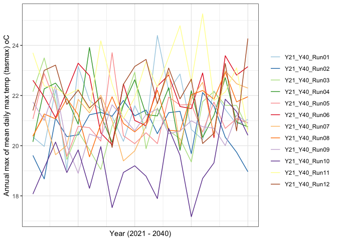<!-- -->

### **boxplot - annual max**

``` r
y21_40_max_y %>% 
  mutate(model = fct_reorder(model, max, .fun='median')) %>%
    ggplot(aes(x=reorder(model, max), y=max, fill=model)) + 
    geom_boxplot() + theme_bw() + 
    ylab("Annual max of mean daily max temp (tasmax) oC") + xlab("model") +
   scale_fill_manual(values = my_colours) +
    theme(axis.text.x=element_blank(),
        axis.ticks.x=element_blank())
```

<!-- -->

### **ANOVA**

Daily means:

``` r
#-1 removes the intercept to compare coefficients of all Runs
av1 <- aov(mean ~ model - 1, y21_40_means)
av1$coefficients[order(av1$coefficients)]
```

    ## modelY21_Y40_Run10 modelY21_Y40_Run05 modelY21_Y40_Run07 modelY21_Y40_Run02 
    ##           10.93136           12.36223           12.64493           12.67791 
    ## modelY21_Y40_Run09 modelY21_Y40_Run03 modelY21_Y40_Run08 modelY21_Y40_Run01 
    ##           12.72584           12.85999           12.92934           13.03640 
    ## modelY21_Y40_Run04 modelY21_Y40_Run12 modelY21_Y40_Run06 modelY21_Y40_Run11 
    ##           13.07768           13.20011           13.38047           13.60076

Annual means:

``` r
av2 <- aov(mean.annual ~ model - 1, y21_40_means_y)
av2$coefficients[order(av2$coefficients)]
```

    ## modelY21_Y40_Run10 modelY21_Y40_Run05 modelY21_Y40_Run07 modelY21_Y40_Run02 
    ##           10.93136           12.36223           12.64493           12.67791 
    ## modelY21_Y40_Run09 modelY21_Y40_Run03 modelY21_Y40_Run08 modelY21_Y40_Run01 
    ##           12.72584           12.85999           12.92934           13.03640 
    ## modelY21_Y40_Run04 modelY21_Y40_Run12 modelY21_Y40_Run06 modelY21_Y40_Run11 
    ##           13.07768           13.20011           13.38047           13.60076

Max of means

``` r
av3 <- aov(max ~ model - 1, y21_40_max_y)
av3$coefficients[order(av3$coefficients)]
```

    ## modelY21_Y40_Run10 modelY21_Y40_Run02 modelY21_Y40_Run09 modelY21_Y40_Run03 
    ##           19.29044           20.69596           20.82538           21.05558 
    ## modelY21_Y40_Run05 modelY21_Y40_Run07 modelY21_Y40_Run08 modelY21_Y40_Run01 
    ##           21.09128           21.22942           21.33484           21.37443 
    ## modelY21_Y40_Run04 modelY21_Y40_Run06 modelY21_Y40_Run12 modelY21_Y40_Run11 
    ##           21.49363           21.98667           22.09476           22.65178

Based on means then selection would be Run 02 (2nd lowest), Run 04 & Run
03, and Run 11 (2nd lowest)

Based on this period, the seelction would be: Run 05, Run 03, Run 08,
Run 06 (so definetly Run 3 but others to be discussed)

### **2c. Y2061 - Y2080**

``` r
Y <- rep(c(2061:2080), each=360)  


dfs_y61_80 <- lapply(names_y61_80, function(i){
  df <- dfs_y61_80[[i]]
  names(df) <- c("day", "mean", "sd")
  df$model <- i
  df$dn <- 1:nrow(df)
  df$Y <- Y
  return(df)
})

#Create a single df in long form of Runs for the y61_80 period 
y61_80_means <- dfs_y61_80 %>% reduce(rbind)
```

### **Time series - daily **

``` r
ggplot(y61_80_means) + 
    geom_line(aes(x=dn, y=mean, group=model, colour=model)) +
  # Removing sd ribbon for ease of viewing
  #geom_ribbon(aes(x =dn, ymin = mean - sd, ymax= mean + sd), alpha=0.4) + 
    theme_bw() + xlab("Day (y61_80 1980 - 2000)") + 
    ylab("Daily mean max temp (tasmax) oC") + 
  #scale_fill_brewer(palette = "Paired", name = "") +
   scale_colour_brewer(palette = "Paired", name = "") +
    theme(axis.text.x=element_blank(),
        axis.ticks.x=element_blank(),
        legend.position = "none") + 
  facet_wrap(.~ model, ncol=3) + guides(fill = FALSE)  
```

<!-- -->

### **boxplot - mean y61_80**

``` r
#Create a pallete specific to the runs so when reordered maintain the same colours 
y61_80_means$model <- as.factor(y61_80_means$model)
c <- brewer.pal(12, "Paired")
my_colours <- setNames(c, levels(y61_80_means$model))
```

``` r
y61_80_means %>% 
  mutate(model = fct_reorder(model, mean, .fun='median')) %>%
    ggplot(aes(x=reorder(model, mean), y=mean, fill=model)) + 
    geom_boxplot() + theme_bw() + 
    ylab("Mean daily max temp (tasmax) oC") + xlab("model") +
    scale_fill_manual(values = my_colours) +
    theme(axis.text.x=element_blank(),
        axis.ticks.x=element_blank())
```

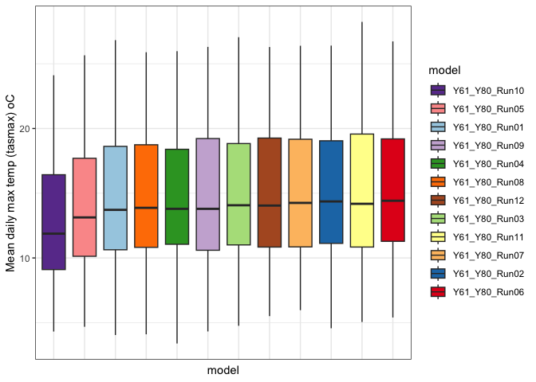<!-- -->

### **qqplot - daily means**

``` r
ggplot(y61_80_means, aes(sample=mean, colour=factor(model))) +
  stat_qq() +
  stat_qq_line()+
  theme_bw()+
  scale_color_manual(values = my_colours) +
  facet_wrap(.~model, ncol=3)
```

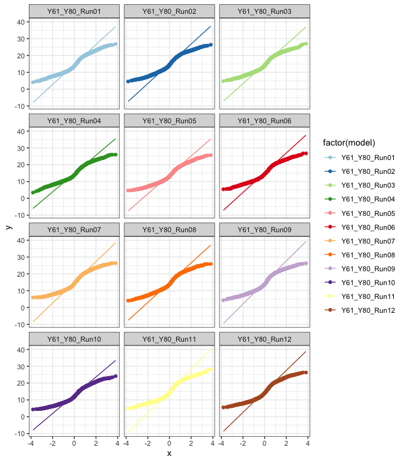<!-- -->

### **Time series - annual mean **

``` r
#Aggregating to year for annual average 

y61_80_means$Yf <- as.factor(y61_80_means$Y)

y61_80_means_y <- y61_80_means %>% 
  group_by(Yf, model) %>%
  dplyr::summarise(mean.annual=mean(mean, na.rm=T), sd.annual=sd(mean, na.rm = T))
```

``` r
ggplot(y61_80_means_y) + 
    geom_line(aes(x = as.numeric(Yf), y=mean.annual, 
              color=model)) +
    theme_bw() + xlab("Year (2061 - 2080)") + 
    ylab("Annual mean of mean daily max temp (tasmax) oC") + 
  scale_fill_brewer(palette = "Paired", name = "") +
   scale_colour_brewer(palette = "Paired", name = "") +
    theme(axis.text.x=element_blank(),
        axis.ticks.x=element_blank()) 
```

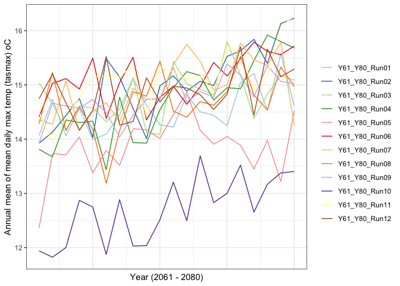<!-- -->

``` r
# Plotting with SDs in geom_ribbon to see if anything wildely different
ggplot(y61_80_means_y) + 
    geom_ribbon(aes(as.numeric(Yf), y=mean.annual, 
                               ymin = mean.annual - sd.annual,
                              ymax= mean.annual + sd.annual,
                    fill=model),  alpha=0.4) + 
    geom_line(aes(x = as.numeric(Yf), y=mean.annual, 
              color=model)) +
    theme_bw() + xlab("Year (2061 - 2080)") + 
    ylab("Annual mean of mean daily max temp (tasmax) oC") + 
  scale_fill_brewer(palette = "Paired", name = "") +
   scale_colour_brewer(palette = "Paired", name = "") +
    theme(axis.text.x=element_blank(),
        axis.ticks.x=element_blank()) + facet_wrap(.~model, ncol=3)
```

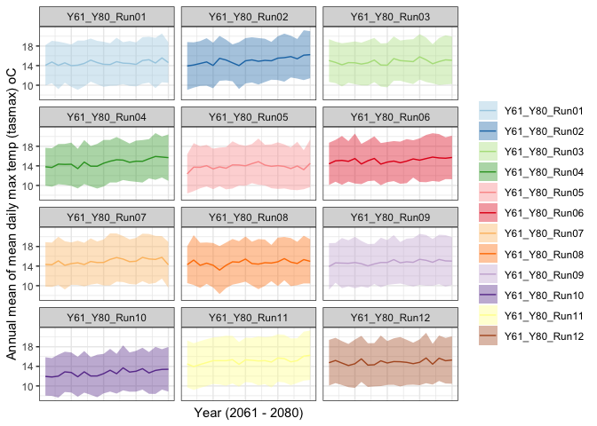<!-- -->

### **boxplot - annual mean y61_80**

``` r
y61_80_means_y %>% 
  mutate(model = fct_reorder(model, mean.annual, .fun='median')) %>%
    ggplot(aes(x=reorder(model, mean.annual), y=mean.annual, fill=model)) + 
    geom_boxplot() + theme_bw() + 
    ylab("Annual max daily max temp oC") + xlab("model") +
   scale_fill_manual(values = my_colours) +
    theme(axis.text.x=element_blank(),
        axis.ticks.x=element_blank())
```

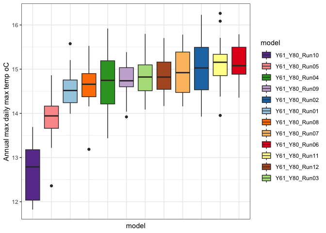<!-- -->

### **qqplot - annual means**

``` r
ggplot(y61_80_means_y, aes(sample=mean.annual, colour=factor(model))) +
  stat_qq() +
  stat_qq_line()+
  theme_bw()+
  scale_color_manual(values = my_colours) +
  facet_wrap(.~model, ncol=3)
```

<!-- -->

### **Time series - annual max **

``` r
y61_80_max_y <- y61_80_means %>% 
  group_by(Yf, model) %>%
  dplyr::summarise(max=max(mean, na.rm=T))
```

``` r
ggplot(y61_80_max_y) +
      geom_line(aes(x = as.numeric(Yf), y=max, 
              color=model)) +
    theme_bw() + xlab("Year (2061 - 2080)") + 
    ylab("Annual max of mean daily max temp (tasmax) oC") + 
  scale_fill_brewer(palette = "Paired", name = "") +
   scale_colour_brewer(palette = "Paired", name = "") +
    theme(axis.text.x=element_blank(),
        axis.ticks.x=element_blank()) 
```

<!-- -->

### **boxplot - annual max**

``` r
y61_80_max_y %>% 
  mutate(model = fct_reorder(model, max, .fun='median')) %>%
    ggplot(aes(x=reorder(model, max), y=max, fill=model)) + 
    geom_boxplot() + theme_bw() + 
    ylab("Annual max of mean daily max temp (tasmax) oC") + xlab("model") +
   scale_fill_manual(values = my_colours) +
    theme(axis.text.x=element_blank(),
        axis.ticks.x=element_blank())
```

<!-- -->

### **ANOVA**

Daily means:

``` r
#-1 removes the intercept to compare coefficients of all Runs
av1 <- aov(mean ~ model - 1, y61_80_means)
av1$coefficients[order(av1$coefficients)]
```

    ## modelY61_Y80_Run10 modelY61_Y80_Run05 modelY61_Y80_Run01 modelY61_Y80_Run08 
    ##           12.70342           13.87016           14.55815           14.65973 
    ## modelY61_Y80_Run04 modelY61_Y80_Run09 modelY61_Y80_Run03 modelY61_Y80_Run12 
    ##           14.69527           14.76917           14.79545           14.87939 
    ## modelY61_Y80_Run07 modelY61_Y80_Run02 modelY61_Y80_Run11 modelY61_Y80_Run06 
    ##           14.94320           15.01577           15.11392           15.11814

Annual means:

``` r
av2 <- aov(mean.annual ~ model - 1, y61_80_means_y)
av2$coefficients[order(av2$coefficients)]
```

    ## modelY61_Y80_Run10 modelY61_Y80_Run05 modelY61_Y80_Run01 modelY61_Y80_Run08 
    ##           12.70342           13.87016           14.55815           14.65973 
    ## modelY61_Y80_Run04 modelY61_Y80_Run09 modelY61_Y80_Run03 modelY61_Y80_Run12 
    ##           14.69527           14.76917           14.79545           14.87939 
    ## modelY61_Y80_Run07 modelY61_Y80_Run02 modelY61_Y80_Run11 modelY61_Y80_Run06 
    ##           14.94320           15.01577           15.11392           15.11814

Max of means

``` r
av3 <- aov(max ~ model - 1, y61_80_max_y)
av3$coefficients[order(av3$coefficients)]
```

    ## modelY61_Y80_Run10 modelY61_Y80_Run05 modelY61_Y80_Run03 modelY61_Y80_Run04 
    ##           21.83290           23.32972           23.88512           23.98220 
    ## modelY61_Y80_Run02 modelY61_Y80_Run01 modelY61_Y80_Run08 modelY61_Y80_Run06 
    ##           23.98610           24.03094           24.13232           24.41824 
    ## modelY61_Y80_Run12 modelY61_Y80_Run09 modelY61_Y80_Run07 modelY61_Y80_Run11 
    ##           24.48810           24.53152           24.77651           25.09102

Runs suggested by this slice are Run 05, Run 09, Run 03 and Run 11

Run 3 and 5 suggested above

## **3. Everything combined**

The result per time slice suggest different runs, aside from run 5

Assessing what the combined times slices suggest via anova

Daily means:

``` r
#-1 removes the intercept to compare coefficients of all Runs
all.means <- rbind(historical_means, y21_40_means, y61_80_means)

x <- as.character(all.means$model)
all.means$model <- substr(x, nchar(x)-4, nchar(x))


av1 <- aov(mean ~ model - 1, all.means)
av1$coefficients[order(av1$coefficients)]
```

    ## modelRun10 modelRun05 modelRun02 modelRun09 modelRun07 modelRun03 modelRun08 
    ##   11.17510   12.48221   12.92077   12.92383   12.93620   13.00464   13.01388 
    ## modelRun01 modelRun04 modelRun06 modelRun12 modelRun11 
    ##   13.01623   13.02117   13.45437   13.46607   13.56872

Annual means:

``` r
all.means_y <- rbind(historical_means_y, y21_40_means_y, y61_80_means_y)

x <- as.character(all.means_y$model)
all.means_y$model <- substr(x, nchar(x)-4, nchar(x))

av2 <- aov(mean.annual ~ model - 1, all.means_y)
av2$coefficients[order(av2$coefficients)]
```

    ## modelRun10 modelRun05 modelRun02 modelRun09 modelRun07 modelRun03 modelRun08 
    ##   11.17510   12.48221   12.92077   12.92383   12.93620   13.00464   13.01388 
    ## modelRun01 modelRun04 modelRun06 modelRun12 modelRun11 
    ##   13.01623   13.02117   13.45437   13.46607   13.56872

Considering all together, suggests: Runs 05, Run03, Run08 and Run12
